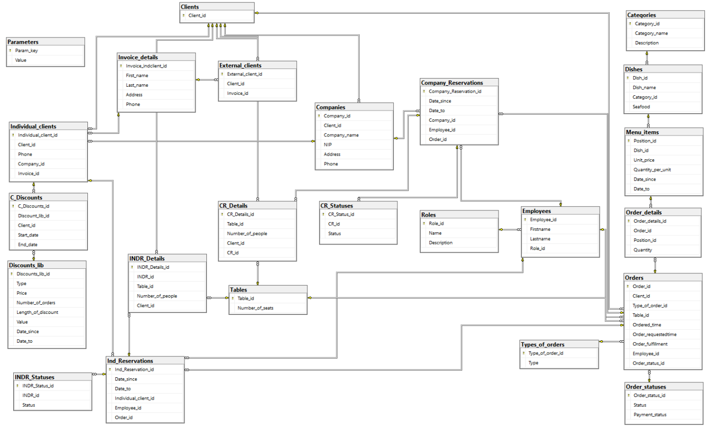

<h1>Restaurant Database</h1>

 Database supporting a catering company.

 The project was carried out as part of the "Database Basics" course at AGH UST in a 3-person team. 

 The description of the task can be found <a href = "https://github.com/zolszowka/Restaurant-Database/blob/main/task.pdf"> here</a> and documentation  
<a href = "https://github.com/zolszowka/Restaurant-Database/blob/main/documentation.pdf"> here</a>.</p?>

<h2>Database diagram:</h2>

<h2>Authors:</h2>
<ul>
<li>Zuzanna Olszówka</li>
<li>Dorota Meszka</li>
<li>Marcin Szwed</li>
</ul>
